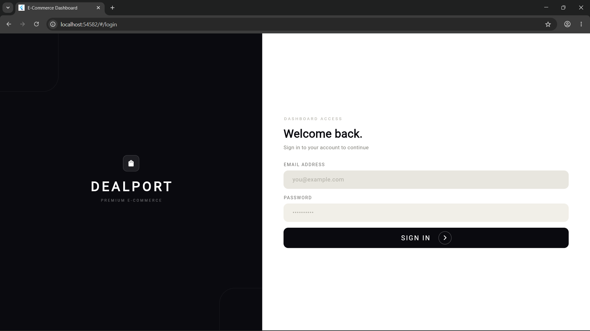
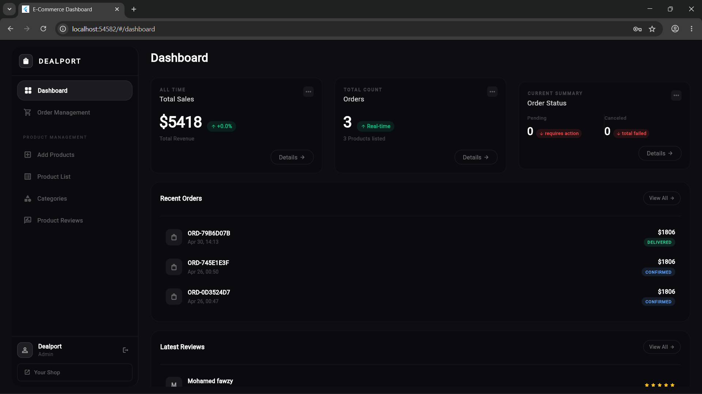
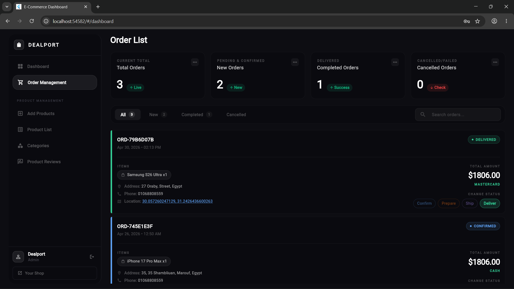
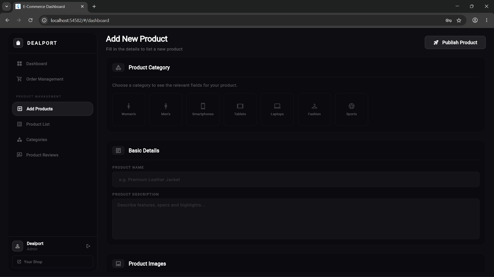
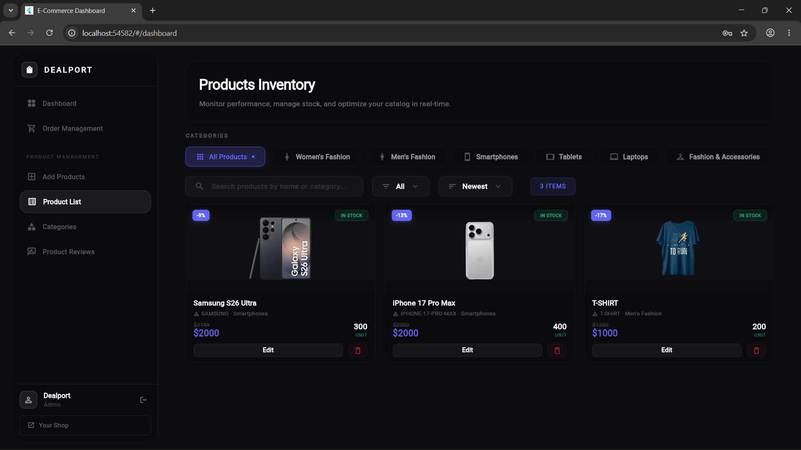
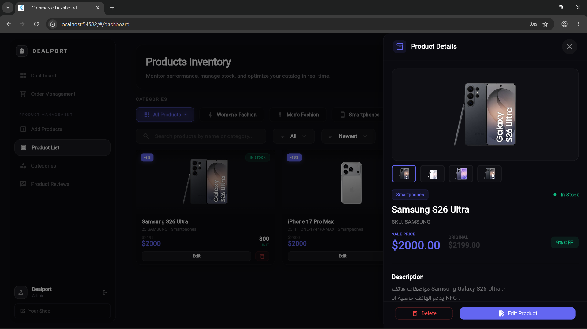
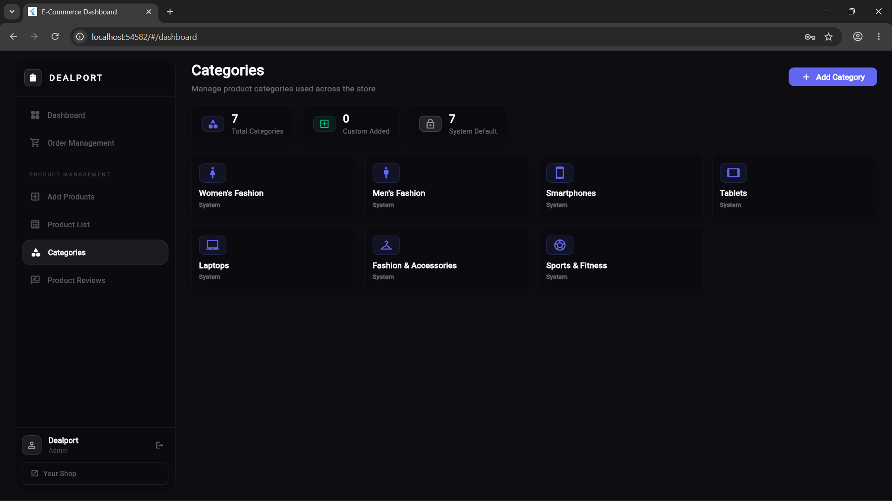
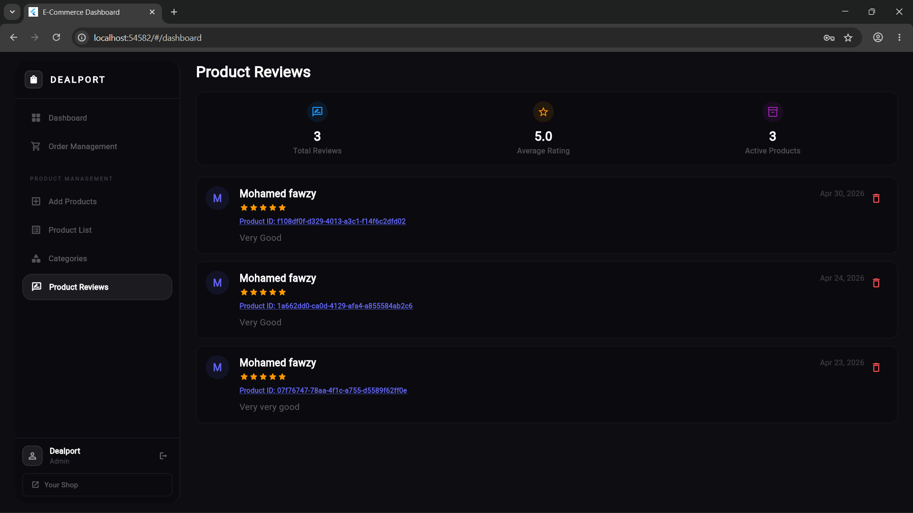

# 🌟 Premium E-commerce Admin Dashboard

A highly professional, fully responsive **Admin Dashboard** tailored for E-commerce management, built with **Flutter Web**. This dashboard features a state-of-the-art **Premium Dark Theme** heavily inspired by modern *Glassmorphism* design trends, offering a deeply immersive and visually stunning experience for store administrators.

> **Note:** This dashboard is exclusively designed for the Web platform, utilizing a strict Dark Theme aesthetic and is currently available in English only.

---

## ✨ Key Features

### 🎨 State-of-the-art UI/UX
- **Premium Dark Glassmorphism:** Every component, from navigation rails to dialogs, features custom dark layouts with semi-transparent backgrounds, subtle borders, and deep shadows.
- **Micro-interactions & Animations:** Smooth transitions, responsive hover effects (`HoverButton`), and animated lists make the interface feel alive and highly responsive.
- **Responsive Layout:** Perfectly scales across different screen sizes (desktop, laptop, tablet) using `flutter_screenutil`.

### 📊 Comprehensive Dashboard Overview
- Real-time statistics summaries (Total Sales, Revenue, Orders, Active Users) displayed in modern, interactive stat cards with mini spark-line charts.
- Top selling products showcase with glassmorphism product cards.

### 🛍️ Product Management
- **Advanced Grid & Table Views:** Switch seamlessly between stunning visual grids and detailed data tables.
- **Product Details:** Rich product details panel with image galleries, specification sheets, and stock indicators.
- **Full CRUD Operations:** Add, edit, and delete products easily. 

### 📦 Order Tracking
- Robust order management table with dynamic status badges (Pending, Processing, Shipped, Delivered).
- Interactive order details highlighting customer info, payment status, and order timeline.

### 🏷️ Category Configuration
- **Dynamic Category Builder:** Create custom categories with specific toggles (Colors, Sizes, Material, etc.).
- Beautiful category cards displaying icon, type, and options in a glassmorphic layout.

---

## 📸 Screenshots Showcase

Here is a glimpse of the meticulously designed interface:

  
   <em>Dashboard Overview - Statistics & Analytics</em>  

  
   <em>Products Grid View - Glassmorphic Cards</em>  

  
   <em>Rich Product Details & Image Gallery</em>  
  
  
   <em>Categories Management & Statistics</em>  

  
   <em>Add Custom Category Dialog</em>  

  

  

  
   <em>Orders Management Table</em>  

*(More screenshots are available in the `screenweb` directory)*

---

## 🛠️ Technology Stack & Architecture

- **Framework:** Flutter (Web Optimized)
- **Language:** Dart
- **State Management:** `flutter_bloc` / `cubit` for clean separation of business logic.
- **Responsiveness:** `flutter_screenutil` to ensure pixel-perfect rendering across standard desktop resolutions.
- **Theming System:** Fully custom dark theme engine replacing standard Material components with tailored `BoxDecoration`, `LinearGradient`, and `BackdropFilter` rules.
- **Routing:** Standard Flutter Navigator/Routes.

---

## 👨‍💻 Developer & Maintainer

  <h3><strong>Developed with ❤️ by <a href="https://github.com/M-Fawzy2004">Mohamed Fawzy</a></strong></h3>
  
Software Engineer & Mobile Application Developer

*This project represents a dedication to writing clean, scalable code while focusing on uncompromising, high-end user interface design.*
