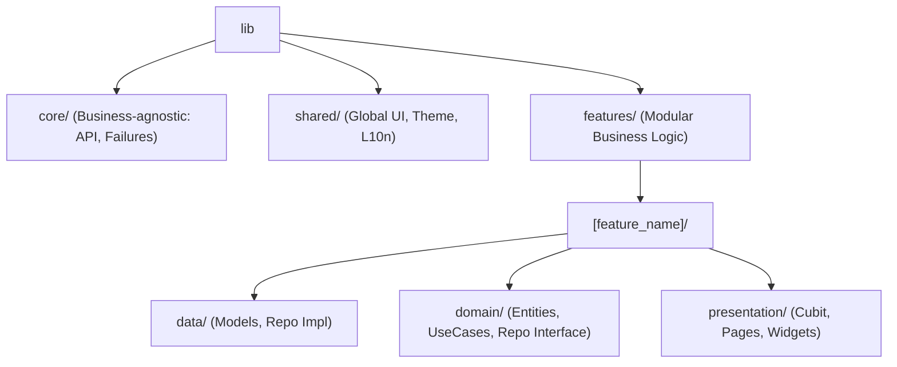

# 🌌 E-COMMERCE DASHBOARD | Engineering & Design Standards

> [!IMPORTANT]
> **Strict Compliance Required.** This document defines the architectural boundaries and UI/UX standards for the Dashboard project. Deviating from these rules requires Lead Developer approval.

---

## 🏗️ 1. Architecture: Feature-First Clean Architecture
The project follows a strict separation of concerns to ensure scalability and testability.

### 📁 Directory Structure


| Layer | Responsibility | Key Components |
| :--- | :--- | :--- |
| **Domain** | Pure Business Logic | Entities, UseCases, Repository Interfaces |
| **Data** | Data Sources & Mapping | Models (JSON mapping), Repository Impl, Remote/Local Sources |
| **Presentation** | UI & State Management | Cubit/Bloc, Pages, Feature-specific Widgets |
| **Core** | Shared Utilities | App Errors, Network Info, Base UseCase, API Clients |

---

## 🎨 2. Design System & UI Standards
We prioritize a **Premium Dark-Theme First** experience with a sleek, modern aesthetic.

### 📐 Responsive Scaling
*   **MANDATORY**: Use `flutter_screenutil` for all dimensions.
*   **Format**: `.w` (width), `.h` (height), `.r` (radius), `.sp` (fontSize).
*   **Spacings**: Use `AppSpacing.v20` (Vertical) and `AppSpacing.h25` (Horizontal) from `shared/theme`.

### 💄 Visual Identity
*   **Palette**: Deep Navy (`#0A192F`), Slate Slate (`#112240`), and Metallic Gold/Electric Blue for accents.
*   **Glassmorphism**: Use `BackdropFilter` for modals and sidebars where appropriate.
*   **Feedback**: Use `AppToast` for quick alerts and `Shimmer` for loading states. **Never show a blank white screen.**

---

## 🌐 3. Localization (AR/EN) & RTL
Hardcoded strings are **FORBIDDEN**. We use `easy_localization`.

*   **Keys**: Defined in `assets/translations/en.json` and `ar.json`.
*   **Naming**: Use snake_case (e.g., `dashboard_total_sales`).
*   **Directional UI**:
    *   ❌ Avoid `Alignment.left` / `Alignment.right`.
    *   ✅ Use `AlignmentDirectional.start` / `AlignmentDirectional.end`.
    *   ✅ Use `Padding.directional` for asymmetrical margins.

```dart
// ✅ CORRECT
Text(LocaleKeys.dashboard_total_sales.tr())

// ❌ FORBIDDEN
Text("Total Sales")
```

---

## 🧩 4. Component Strategy: Page/Body Pattern
To keep files readable and maintainable, every screen MUST be split:

1.  **`[feature]_page.dart`**: The entry point. Handles `BlocProvider`, `Scaffold`, and high-level routing logic.
2.  **`[feature]_page_body.dart`**: The main layout. **Max 120 lines.**
3.  **`widgets/`**: Extract complex subsets (e.g., `OrderTable`, `UserForm`) into separate files within the feature's widget folder.

---

## ⚙️ 5. State Management & Logic
*   **Management**: Use **Cubit** for standard UI states. Use **Bloc** only for complex event-streams (e.g., Socket connections).
*   **Dependency Injection**: Use `GetIt` for all repositories and use cases.
*   **Validation**: centralized in `core/utils/validators.dart`. No inline regex in UI.

---

## 📝 6. Code Quality & File Limits
| File Type | Max Lines | Primary Rule |
| :--- | :--- | :--- |
| `_page.dart` | 60 | No UI logic. Only providers and Scaffold. |
| `_page_body.dart`| 130 | Layout only. Extract large widgets. |
| `_cubit.dart` | 150 | No UI references. Logic and state only. |
| `_widgets.dart` | 200 | Keep them generic if possible. |

---

## 🚀 7. Performance & Git Workflow
*   **Images**: Always use `CachedNetworkImage` for external assets.
*   **Git Commits**: Follow [Conventional Commits](https://www.conventionalcommits.org/):
    *   `feat: add product search functionality`
    *   `fix: resolve overflow on mobile sidebar`
    *   `style: update dashboard card gradients`
*   **Lints**: Ensure `flutter analyze` passes 100% before any PR.

---

> [!TIP]
> **Pro-Tip**: Always check the `shared/widgets` directory before building a new UI element. Consistency is the hallmark of a professional dashboard.